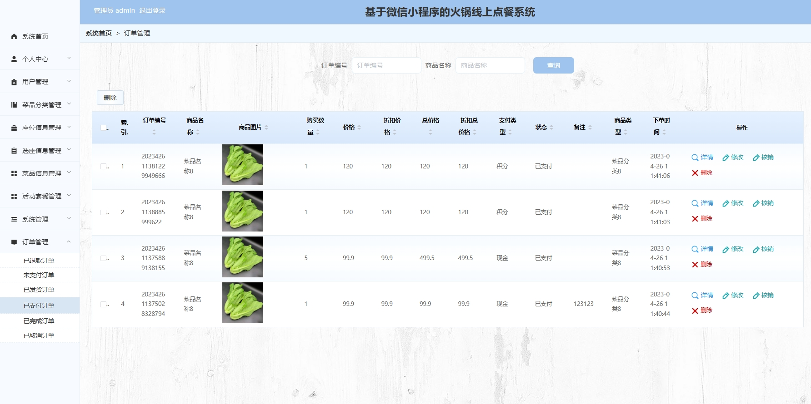

**项目经过本人本地测试，确保可以运行，功能正常**
# 1.项目介绍

- 测试环境:IDEA2022,MySQL5.7,微信开发工具,Maven3,Tomcat8

- 技术栈:SSM,uniapp,Vue

- 项目架构:

# 2.项目部署
## 2.1 后端启动
- 通过navicatc创建数据库huoguo,编码utf8mb4,并导入sql
- 通过idea打开后端项目admin-api, 根据本地数据库环境修改 src/main/resources/config.properties  3-5行
- 配置tomcat,注意将配置项deployment下的Application context改为/ssm8wj2f,启动tomcat
- 打开后端管理web:  http://localhost:8080/ssm8wj2f/admin/dist/index.html  管理员账号密码: admin/admin
## 2.2 小程序启动
- 可以直接通过微信开发工具打开压缩包内的mp-weixin, 也可以通过HbuilderX打开admin-api的webapp目录下的front. ps:mp-weixin是已经编译好的,你也可以自己编译front
- appid选用测试号就可以
- 查询yonghu表的账号密码, 登录
# 3.项目部分截图

# 4.获取方式
[戳我查看](https://gitee.com/aven999/mall)     
         

